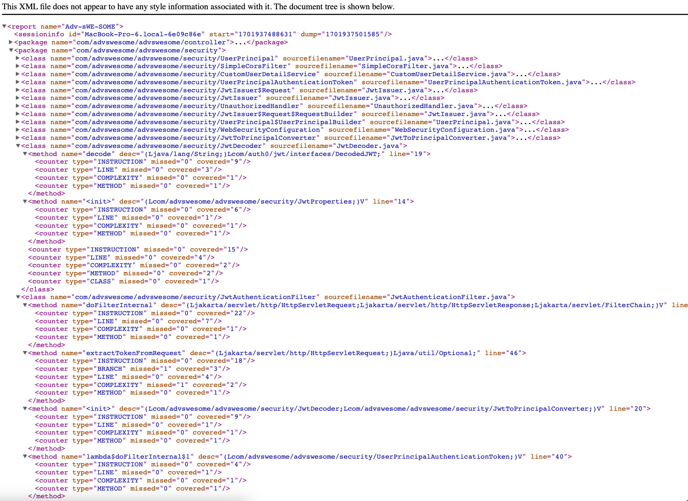
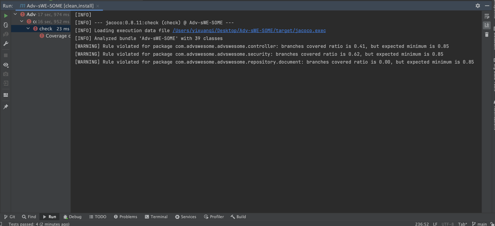
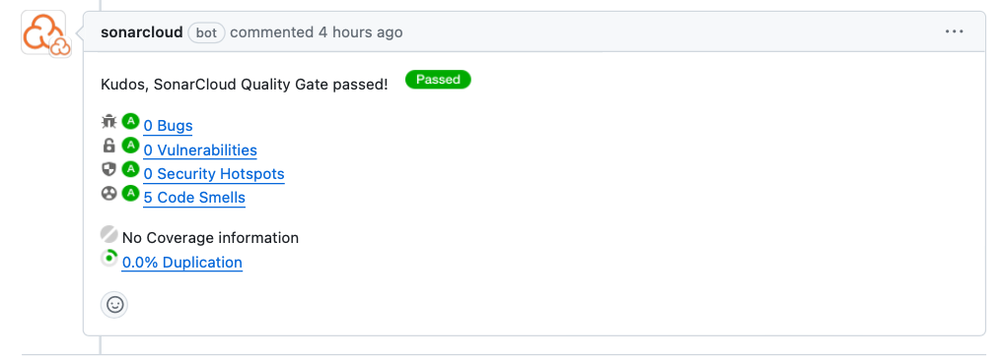

# Adv-sWE-SOME
Welcome to Adv-sWE-SOME, our incredible project crafted during the Fall 23 COMS W4156 Advanced Software Engineering course. We’ve leveraged the power of Spring Boot to engineer an efficient API service, and paired it with Google Cloud Firestore for a seamless, robust database experience—all readily configured for local development and testing.

## Third Party Library Used
Below are third party libraries included in build files.

1. *[Maven](https://maven.apache.org)*: Dependency management
2. *[Spring Boot](https://spring.io/projects/spring-boot/)*: Project Framework, support creation of web RESTful APIs.
3. *[Google Cloud Firestore Database](https://cloud.google.com/firestore#)*: Project database on cloud.
4. *[Spring Cloud GCP](https://spring.io/projects/spring-cloud-gcp)*: Access and connect to GCP databse.
5. *[Junit 5](https://junit.org/junit5/)*: Unit Testing.
6. *[Mockito](https://site.mockito.org)*: Service mocking Library for Unit Testing.
7. *[Reactor Test](https://projectreactor.io/docs/test/release/api/)*: Aids in effectively testing reactive programming constructs.
8. *[OpenAI API](https://openai.com/api/)*: Used for integrating OpenAI's API to provide health advice.
9. *[Spring Security](https://spring.io/projects/spring-security)*: Security framework for authentication and authorization.
10. *[Spring WebFlux](https://docs.spring.io/spring-framework/docs/current/reference/html/web-reactive.html)*:  For building reactive web applications.
11. *[Lombok](https://projectlombok.org/)*:Java library that simplifies coding, reducing boilerplate code.
12. *[Auth0 Spring Security API](https://auth0.com/docs/libraries/auth0-spring-security-api)*: Integration of Auth0 with Spring Security for authentication and authorization.
13. *[JSON Web Token](https://jwt.io/)*: Implementation of JWT for secure token creation and validation.
14. *[Jacoco](https://www.jacoco.org)*: Used to generate code coverage report.

## Building and Running the Project

### GCP credential Setup
Download GCP SDK - MacOS
```
brew install --cask google-cloud-sdk   
```

Initiate and Login to GCP Console and Select Project Adv-sWE-SOME
(group-member and teaching staff team are granted access. Login using your lion mail)

access member:
- yq2339@columbia.edu (Team Member)
- fz2356@columbia.edu (Team Member)
- yw3959@columbia.edu (Team Member)
- zz2919@columbia.edu (Team Member)
- zz2978@columbia.edu (Team Member)
- rs4489@columbia.edu (TA)

Please contact yq2339@columbia.edu for access grant.

```
gcloud init

gcloud auth application-default login  
```

### To build project (Service):
```
mvn clean install
```

or 

```
./mvnw clean install
```

### Run Project (Service): 

```
mvn spring-boot:run
```

or

```
 ./mvnw spring-boot:run
```

### Run All Unit Tests (Service):
```
mvn test
```

or 

```
./mvnw test
```

### Client Build/Run Instructions

Please refer to ./health_portal/readme.txt

```
cd health_portal
```


## CheckStyler
Implemented with the Maven Checkstyle Plugin to ensure code quality. Configurations and rules are specified in the checkstyle.xml file.
Run check style using:
```
mvn checkstyle:check
```

## Check Styler Report:

[Link](https://docs.google.com/document/d/1p9d6-la6pbGDijPt1cAh0kLuJD1Z9VA-zEDq7zqw6z0/edit?usp=sharing) to Checkstyler report.

## API System Testing Report:

[Link](https://docs.google.com/document/d/1jxLKYlbAJtigIxv0DPgtTj_rBpCIkzH_BqBnStyGRUs/edit?usp=sharing) to API system testing report.

## Multiple Client Instance

### Multi-Client Setup
In our project setup, each client would obtain a unique id upon registration. Each client have their own set of users, users from one client cannot login to other clients. See integration tests in:
```
src/test/java/com/advswesome/advswesome/MultiClientIntegrationTest.java
```
Note: When login API requires clientId and user credentials (email, password). After user login, user will receive a token and all following access will validate user tokens. This ensure data isolation between clients.

### GCP Deployment
The service is deploy on GCP App Engine, allow multiple client access simultaneously and send corresponding responses only to the appropriate clients.
```
https://adv-swe-some.uc.r.appspot.com
```
Also included test in the test suit to check for concurrency request and send corresponding response to appropriate clients, using concurrency profile creation as example:
```
src/test/java/com/advswesome/advswesome/MultiClientConcurrencyTest.java
```

## Continuous Integration

CI code location:
```
.github/workflows/mavenTests.yml
```

### Triggering CI

CI is trigger on two events:

1. Push to the Main Branch
2. Pull Request to the Main Branch

### CI Steps

1. Checkout Code
2. Set up GCP Credentials: we are using gcp firestore and secret manager to store openai-api-key. Setting up GCP credentials using a service account helps CI to build our project.
3. Set up JDK 19
4. Build Project with Maven (This step will fail for branch coverage < 85%, for details view Branch Coverage section)
5. Run Tests with Maven (This step also create branch coverage report, for details view Branch Coverage section)
6. Run Style Checker with Maven

### CI Reports

CI reports can be views on Github Action interface. We have also attach SonarCloud report under CI.

## Branch Coverage
Jacoco library was used to generated coverage report for our codebase. Each time `./mvnw test`  or `./mvnw clean install`is executed, a coverage report will be generated under `./target/site/jacoco/jacoco.xml`. 

A final report was also copied and attached in `reports/coverage-report.xml`.


Verification of 85% branch coverage was ensured. Check was added on build, when branch coverage < 85%, will fail to build.

We have achieve > 85% on our final branch coverage, however a example below provided build check fail case:

### Example On branch coverage < 85%


## Bug Finder 

SonarCloud Bug Finder and analysis report would be produced with CI for each push or pull request to the main branch.
Example: 


## End-to-End Testing

checklist: TODO!!!!!!!

## External Integration Tests

checklist: TODO !!!!!!

## API documentations

### Client Registration

- #### /clients/register
  - `POST`
  - Description: Register a new app/client to use our service
  - Input:
    - Header: 
      - `Content-Type`: `application/json`
    - Body(JSON) Fields:
      - `appName` (String)
      - `clientType` ("INDIVIDUAL", "ORGANIZATION", "HOSPITAL").
  - Output:
    - On Success: 
      - Status Code: `200`
      - JSON with field
        - `clientId`
        - `apiKey`
        - `appName`
        - `clientType`

- #### /clients/{clientId}
  - `GET`
  - Description: Get a new client by Id
  - Output:
    - On Success:
      - Status Code: `200`
      - JSON with field
        - `clientId`
        - `apiKey`
        - `appName`
        - `clientType`

### Authentication

- #### users/auth/register
  - `POST`
  - Description: Register a new user
  - Input:
    - Header:
      - `Content-Type`: `application/json`
    - Body(JSON) Fields:
      - `clientId` (String)
      - `username` (String)
      - `password` (String)
      - `email` (String)
      - `createdAt` (Timestamp String)
      - `updatedAt` (Timestamp String)
  - Output:
    - On Success:
      - Status Code: `200`
      - JSON with field
        - `userId`
        - `clientId`
        - `username` 
        - `password`
        - `email`
        - `createdAt`
        - `updatedAt`

- #### users/auth/login
  - `POST`
  - Description: Login a user
  - Input:
    - Header
      - `Content-Type`: `application/json`
    - Body(JSON) Fields:
      - `clientId` (String)
      - `username` (String)
      - `password` (String)
  - Output
    - On Success:
      - Status Code: `200`
      - JSON with JWT token

### Profile

- #### /profiles
  - `POST`
  - Description:  Create a new profile
  - Authentication: Bearer JWT token, Owner Only
  - Input: 
    - Header
      - `Content-Type`: `application/json`
      - `Authorization`: Bearer token
    - Body(JSON) Fields:
      - `userId` (String)
      - `age` (String)
      - `sex` (String)
      - `location` (String)
      - `physical_fitness` (String)
      - `language_preference` (String)
      - `medical_history`  (List of medical history)
        - medical history:
          ```
          {
          `disease_name`,
          `diagnosed_at`, 
          `treatment`
          }
          ```
  - Output:
    - On Success:
      - Status Code: `200`
      - JSON with Fields:
        - `profileId`
        - `userId`
        - `age` 
        - `sex` 
        - `location`
        - `physical_fitness` 
        - `language_preference` 
        - `medical_history` 


- #### /profiles/{profileId}
  - `GET`
  - Description: Get a profile by ID
  - Authentication: Required, owner and user with consent only
  - Input:
    - Header
      - `Authorization`: Bearer token
  - Output:
    - On Success:
      - Status Code: `200`
      - JSON with Fields:
          - `profileId`
          - `userId`
          - `age`
          - `sex`
          - `location`
          - `physical_fitness`
          - `language_preference`
          - `medical_history` 

- #### /profiles/{profileId}
  - `PUT`
  - Description: Update a profile
  - Authentication: Required, owner only
  - Input
    - Header
        - `Content-Type`: `application/json`
        - `Authorization`: Bearer token
    - Body(JSON) Fields:
        - `userId` (String)
        - `age` (String)
        - `sex` (String)
        - `location` (String)
        - `physical_fitness` (String)
        - `language_preference` (String)
        - `medical_history`  (List of medical history)
          - medical history:
            ```
            {
            `disease_name`,
            `diagnosed_at`, 
            `treatment`
            }
            ```
  - Output:
    - On Success:
      - Status Code: `200`
      - JSON with Fields:
          - `profileId`
          - `userId`
          - `age`
          - `sex`
          - `location`
          - `physical_fitness`
          - `language_preference`
          - `medical_history` 

- #### /profiles/user/{userId}
  - `GET`
  - Description: Get all profile of this user
  - Authentication: Required, owner only
  - Input
    - Header
      - `Authorization`: Bearer token
  - Output:
    - On Success:
      - Status Code: `200`
      - JSON with list of profiles

- #### /profiles/{profileId}
  - `DELETE`
  - Description: Delete a profile
  - Authentication: Required, owner only
  - Input
    - Header
      - `Authorization`: Bearer token
  - Output:
    - On Success:
      - Status Code: `200`

### Prescriptions

- #### /prescriptions
  - `POST`
  - Description: Create a new prescription
  - Authentication: Required
  - Input
    - Header
      - `Content-Type`: `application/json`
      - `Authorization`: Bearer token
    - Body
      - `prescriptionId` (String)
      - `profileId` (String)
      - `rx_number` (Integer)
      - `rx_provider` (String)
      - `rx_name` (String)
      - `refills` (Integer)
      - `quantity` (Integer)
  - Output 
    - On Success
      - Status Code: `201`
      - JSON with field:
        - `prescriptionId` (String)
        - `profileId` (String)
        - `rx_number` (Integer)
        - `rx_provider` (String)
        - `rx_name` (String)
        - `refills` (Integer)
        - `quantity` (Integer)

- #### /prescription/{prescriptionId}
  - `GET`
  - Description: Get a prescription by Id 
  - Authentication: Required, owner only
  - Input:
    - Header:
      - `Authorization`: Bearer token
  - Output:
    - On Success
      - Status Code: `200`
      - JSON with Fields:
        - `prescriptionId`
        - `profileId` 
        - `rx_number`
        - `rx_provider`
        - `rx_name` 
        - `refills` 
        - `quantity`
    - On Error - Not Found
      - Status Code: `404`

- #### /prescription/{prescriptionId}
  - `PUT`
  - Description: Update a prescription
  - Authentication: Required, owner only
  - Input
    - Header
        - `Content-Type`: `application/json`
        - `Authorization`: Bearer token
    - Body
        - `prescriptionId` (String)
        - `profileId` (String)
        - `rx_number` (Integer)
        - `rx_provider` (String)
        - `rx_name` (String)
        - `refills` (Integer)
        - `quantity` (Integer)
  - Output
    - On Success
      - Status Code: `200`
      - JSON with Fields:
          - `prescriptionId`
          - `profileId`
          - `rx_number`
          - `rx_provider`
          - `rx_name`
          - `refills`
          - `quantity`
    - On Error - Not Found
        - Status Code: `404`

- #### /prescription/{prescriptionId}
  - `DELETE`
  - Description: Delete a prescription 
  - Authentication: Required, owner only
  - Input:
    - Header:
      - `Authorization`: Bearer token
  - Output:
    - On Success
      - Status Code: `204`
    - On Error - Not Found 
      - Status Code: `404`

- #### /prescription/profile/{profileId}
  - `GET`
  - Description: Get prescription base on profile id
  - Authentication: Required, owner only
  - Input:
    - Header:
      - `Authorization`: Bearer token
  - Output
    - On Success
      - Status Code: `200`
      - JSON List of Object with Fields:
        - `prescriptionId`
        - `profileId`
        - `rx_number`
        - `rx_provider`
        - `rx_name`
        - `refills`
        - `quantity`

### Consents 

- #### /consents
  - `POST`
  - Description: Create a new consent 
  - Authentication: Required
  - Input:
    - Header
        - `Content-Type`: `application/json`
        - `Authorization`: Bearer token
    - Body
      - `consentId` (String)
      - `userId` (String)
      - `profileId` (String)
      - `permission` (Boolean)
      - `updatedAt` (Timestamp String)
  - Output:
    - On Success
      - Status Code: `201`
      - Message: `Consent created successfully with ID {consentID}`
    - On Duplicated `consentId`:
      - Status Code: `409`
      - Message: `Consent with ID {consentId} already exists`

- #### /consents/{consentId}
  - `GET`
  - Description: Get consent by consentId 
  - Authentication: Required
  - Input: 
    - Header
      - `Authorization`: Bearer token
  - Output:
    - On Success
      - Status Code: `200`
      - JSON with Fields:
          - `consentId`
          - `userId`
          - `profileId`
          - `permission`
          - `updatedAt` 
    - On Error - Not Found
      - Status Code: `404`

- #### /consents/{consentId}
  - `PUT`
  - Description: Update a consent
  - Authentication: Required
  - Input:
    - Header
        - `Content-Type`: `application/json`
        - `Authorization`: Bearer token
    - Body
        - `consentId` (String)
        - `userId` (String)
        - `profileId` (String)
        - `permission` (Boolean)
        - `updatedAt` (Timestamp String)
  - Output:
    - On Success
      - Status Code: `200`
      - JSON with Fields:
          - `consentId`
          - `userId`
          - `profileId`
          - `permission`
          - `updatedAt` 
    - On Error - Not Found
      - Status Code: `404`

- #### /consents/{consentId}
  - `DELETE` 
  - Description: Delete a consent
  - Authentication: Required
  - Input:
    - Header
      - `Authorization`: Bearer token
  - Output:
    - On Success
      - Status Code: `200`
    - On Error - Not Found
      - Status Code: `404`

- #### /consents/profile/{profileId}
  - `GET`
  - Description: Get consent by profile Id
  - Authentication: Required
  - Input:
    - Header
      - `Authorization`: Bearer token
  - Output:
    - On Success
      - Status Code: `200`
      - List of JSON Object with Fields:
        - `consentId`
        - `userId`
        - `profileId`
        - `permission`
        - `updatedAt`

- #### /consents/user/{userId}
  - `GET`
  - Description: Get consent by user Id
  - Authentication: Required
  - Input:
    - Header
      - `Authorization`: Bearer token
  - Output:
    - On Success
      - Status Code: `200`
      - List of JSON Object with Fields:
        - `consentId`
        - `userId`
        - `profileId`
        - `permission`
        - `updatedAt`

### Analytics

- #### /analytics/{profileId}
  - `GET`
  - Description: Get health advise based on profile
  - Input: 
    -  Header
        - `Authorization`: Bearer token
  - Output:
    - On Success
      - Status Code: `200`
      - String containing health advise.
